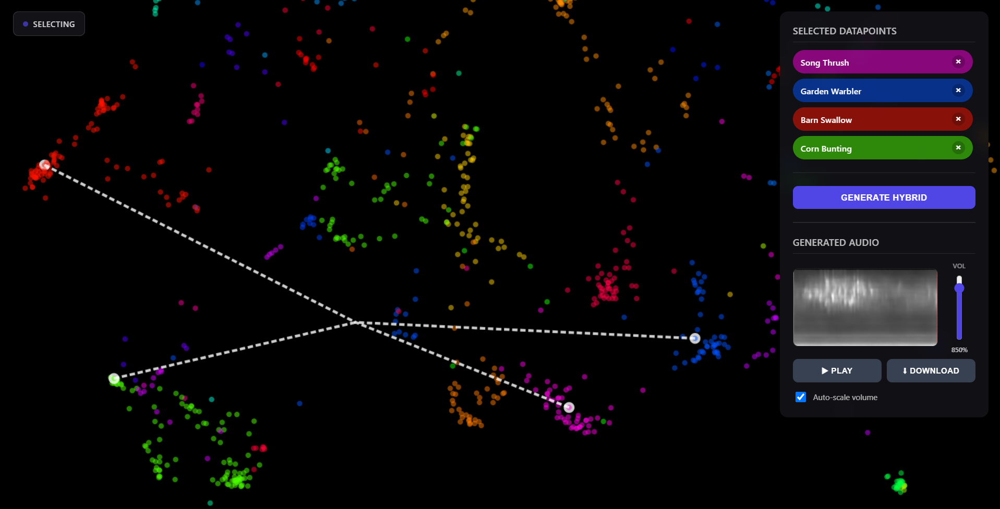
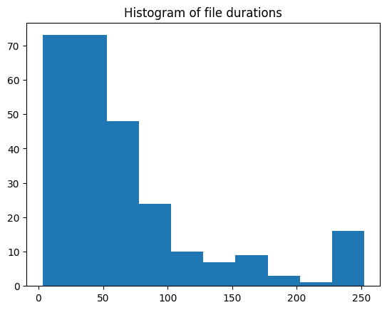
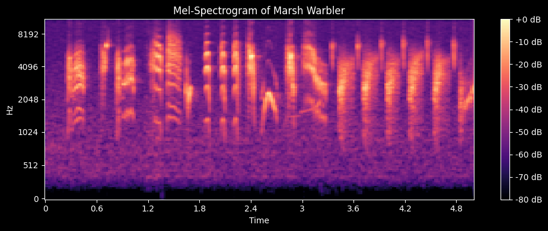
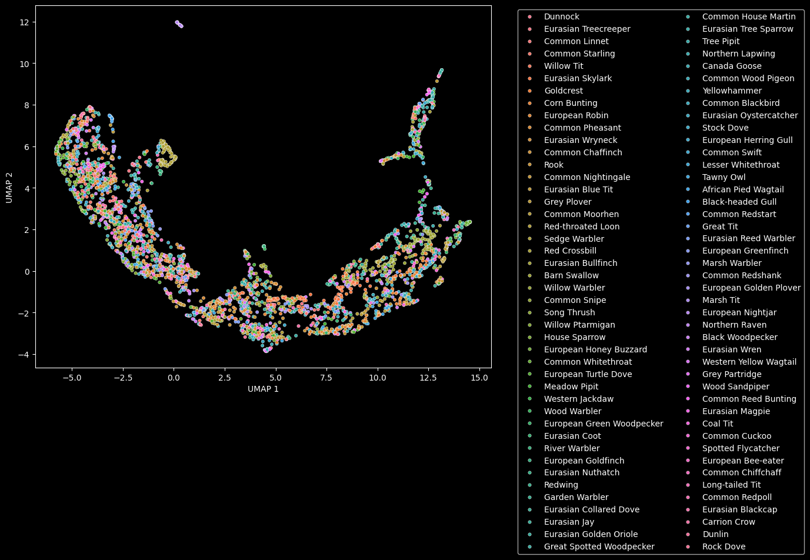
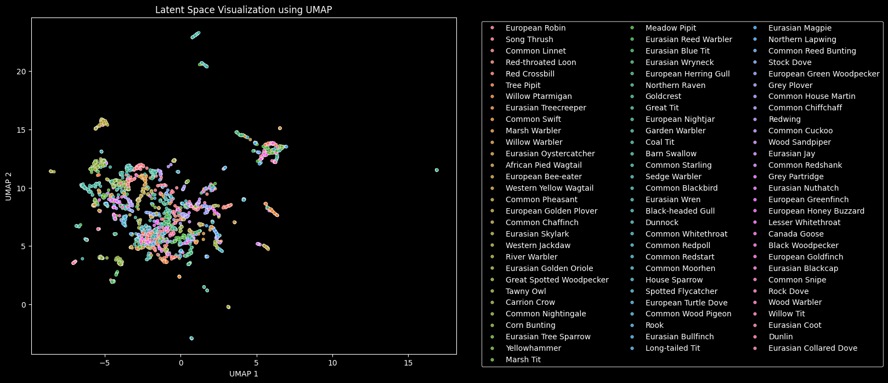
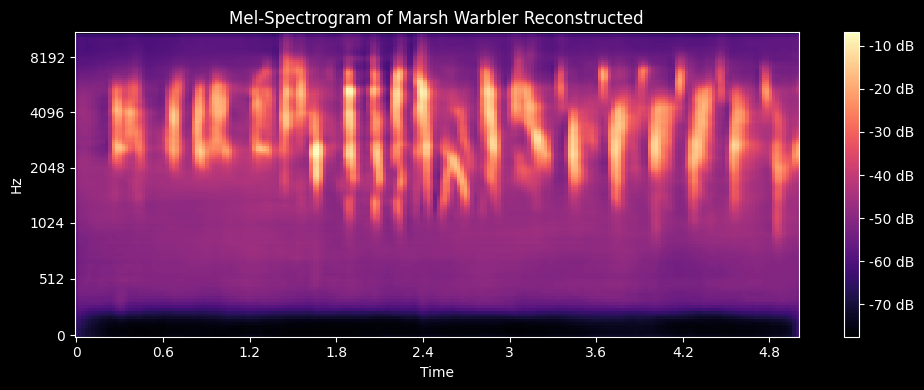
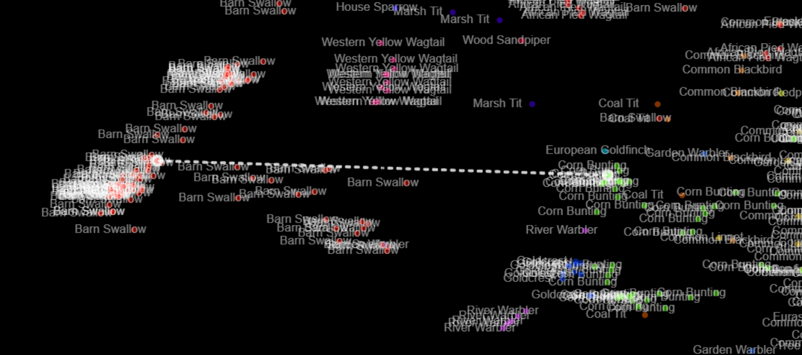
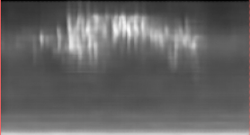

# Bird Song Generator using a Convolutional Self Attention based Variational Autoencoder #

## Table of Contents
* [Summary](#summary)
* [Data Preparation](#data-preparation)
* [Model Architecture](#model-architecture)
* [Training](#training)
* [Results](#results)
    * [Hybrid Birdsongs](#hybrid-birdsongs)

## Summary
Read the following sections for an in-depth description of the model and training process.

The [Interactive Web UI](https://bitarmada.github.io/Bird-Song-Generator/interactiveUI/) allows users to explore the VAE's latent space visually and generate their own hybrid bird songs. Click on the link below to access the website and try it for yourself.


https://bitarmada.github.io/Bird-Song-Generator/interactiveUI/

Pan and zoom to explore the UMAP projections of each datapoint; labels for each species will appear if you zoom in. Click on a data point to add it to your selection; click the “X” icon on the left of each selected data point to remove it from your selection. Click “Generate Hybrid” to run the model on the latent vectors you selected. Note if only one data point was selected the model will reconstruct only that data point. The decoder was compiled for the web and runs locally using JavaScript, so it may take a few seconds for a spectrogram to generate. Once generated, a spectrogram will appear in the menu; press the play button to hear the audio. If the audio is too quiet, use the volume slider to increase its volume. Finally, the download button allows you to save the generated audio as a .wav file (the file's volume is also determined by the slider). 

## Data Preparation
The Birdsong dataset consists of 264 audio files and corresponding species labels. Files vary significantly in duration from a few seconds to a few minutes.



To encode all recordings using the same model, I first split each recording into 5-second chunks. Rather than simply feeding the raw audio data to the network, I choose to transform the data into the frequency domain by creating 2d spectrograms. The spectrogram frequencies were mapped to the MEL scale, which accounts for how frequencies are perceived non-linearly.



The chunk data was then stored as PyTorch tensors in the ```processed_spectrograms/``` directory along with [metadata.csv](metadata.csv) for labels.
See [process_data.ipynb](process_data.ipynb) for the the full data processing code.

## Model Architecture
A traditional autoencoder consists of two parts: an encoder that converts the spectrogram data into a latent embedding vector, and a decoder that reproduces the original spectrogram from the latent embedding vector. This model architecture has proven somewhat successful at reproducing data points given exact embedding vectors; however, it struggles to generate novel data from arbitrary embeddings. To address this issue, variational autoencoders replace the raw latent vector with a smooth probability distribution to create a meaningful data manifold that can be continuously sampled between data points. This is accomplished by forcing the encoder to produce a mean and variance for each axis in the latent space. This Gaussian distribution is sampled during training to produce latent vectors that vary slightly, which the generator must then map to the original spectrogram in this case. It is the overlap in distributions that forces the model to blend different characteristics from both bird songs to satisfy either of the possible loss functions. Naturally, only training to reconstruct the original spectrograms would cause the encoder to minimize variance and push the means as far apart as possible, producing very tight distributions with no overlap. To counteract this effect, the reconstruction loss is combined with a KL divergence loss term, which penalizes the model for producing distributions that deviate from a standard Gaussian. The balance of these two terms must be carefully tuned to keep the distributions overlapping, but maintain enough distinction to regenerate the original spectrograms.

This project employs a unique variational autoencoder implemented in PyTorch that combines convolutional layers, self-attention, and residual blocks. The encoder consists of 3 downsampling convolutional blocks, each with batch normalization and LeakyReLU activation, followed by a standard linear layer with tanh activation. The output of this layer is twice the latent dimension to account for both means and variances. The decoder is more complex and underwent numerous iterations to produce clear spectrograms. The latent vectors first pass through a linear layer to increase the size of the vector so that it can be passed into the spatial upsampling layers. The first spatial processing layer is a 2d Self Attention block, which serves as a starting point for successive residual upsampling blocks.

See [model.py](model.py) for the full implementation.

 

## Training
Training the model proved to be difficult initially due to the delicate balance between reconstruction and KL loss. The first two versions of the model suffered from a phenomenon known as posterior collapse, in which the data distribution formed an indiscriminate blob that failed to fully capture the information required to differentiate the data points. As a result, the reconstructed spectrograms contained only low-amplitude background noise.

In order to visualize the latent space of the model, UMAP was used to convert the 128-dimensional latent space to 2 dimensions for plotting.


Above are two examples of failed attempts that resulted in posterior collapse and blurry low-amplitude spectrograms.

To address these issues, I first changed the traditional KL loss to an elementwise approach that only penalized the model for values above a certain threshold. The second major change was replacing the simple MSE reconstruction loss with a weighted sum of several loss functions that penalize blurry reconstructions.

$$
R_{MSE} = \frac{1}{N}\sum_{i=1}^{N}{(y_i-\hat{y}_i)^2}
$$

The Frobenious normalized error is similar to MSE, but does not depend on the scale of the output. 
$$
% R_{Spectral} = \frac{1}{N}\sum_{i=1}^{N}{\frac{\lVert Y_i-\hat{Y}_i \rVert_F}{ \lVert \hat{Y}_i \rVert_F}}
R_{Spectral} = {\frac{\lVert Y_i-\hat{Y}_i \rVert_F}{ \lVert \hat{Y}_i \rVert_F}}
$$
Where $Y_i$ and $\hat{Y}_i$ are the reconstructed and target spectrogram matrices, respectively.

The edge loss penalizes the model if the spatial gradients of the reconstructed spectrogram do not match the target’s spatial gradients.
$$
R_{edge} = \frac{1}{N}\sum_{i=1}^{N}{(\nabla_xY_i-\nabla_x\hat{Y}_i)^2+(\nabla_yY_i-\nabla_y\hat{Y}_i)^2}
$$

The total reconstruction loss is a weighted sum of all of these loss functions.
$$
R_{total} = R_{MSE}*\theta_{MSE}+R_{Spectral}*\theta_{Spectral}+R_{edge}*\theta_{edge}
$$

All the hyperparameters $\theta$ for the model are stored in a data class called ```VAEhyperparameters```. The default values are those that  I used to train the most successful model.

```py
@dataclass
class VAEHyperparams:
    latent_dim: int
    encoder_kernel_shape: tuple[int] = (3,3)
    decoder_kernel_shape: tuple[int] = (4,4)
    use_softplus_std: bool = True;
    pixel_reconstruction_weight: float = 1.0;
    spectral_reconstruction_weight: float = 0.5;
    edge_reconstruction_weight:float = 1000.0
    kl_elementwise_threshold: float = 0.5;
```

The individual loss function outputs along with the totals are also stored in a dataclass called `VAEOutput` returned by the model when it runs.

```py
@dataclass
class VAEOutput:
    z: torch.Tensor
    mu: torch.Tensor
    std: torch.Tensor
    reconstruction: torch.Tensor

    # total loss
    loss: torch.Tensor

    # kl and reconstruction contributions
    loss_recon: torch.Tensor
    loss_kl: torch.Tensor

    # all reconstruction losses
    loss_recon_pixel: torch.Tensor
    loss_recon_spectral: torch.Tensor
    loss_recon_edge: torch.Tensor
```
The final model was successfully trained after 100 epochs on my laptop CPU. The best model can be downloaded from [/published models/v4_best.pt](/published%20models/v4_best.pt) along with the best models from previous versions.



Above is the latent space visualization for the successful model with the species names on the right.

See [training.py](training.py) for the training code and [model.py](model.py) for the loss functions.

## Results

The VAE is capable of accurately reconstructing the input spectrograms from their latent embeddings. For some data points, the reconstructed audio files are indistinguishable from the original data. The generated spectrograms, however, are visibly different from the original data as they are smoother and lack sharp background noise, as shown below.




### Hybrid Birdsongs
Hybrid bird songs can be generated by taking the average of two or more latent embedding vectors and feeding the resultant vector to the decoder. This averaging technique generally yields clear birdsongs for data points that are closer together in the latent space. If latent vectors are extremely far apart, their average can sometimes land outside of the data manifold, leading to unlear noise like results. Similarly, if too many vectors are averaged, the result will lack definition.

#### Barn Swallow x Corn Bunting
Latent Vectors in UMAP Web UI and Generated spectrogram



[Barn Swallow x Corn Bunting](examples/Barn%20Swallow%20x%20Corn%20Bunting.wav)

<audio controls>
  <source src="examples/Barn Swallow x Corn Bunting.wav" type="audio/wav">
  Your browser does not support the audio element.
</audio>

#### Coal Tit x Eurasian Wren
Latent Vectors in UMAP Web UI and Generated spectrogram


[Coal Tit x Eurasian Wren](examples/Coat%20Tit%20x%20Eurasian%20Wren.wav)

<audio controls>
  <source src="examples/Coat Tit x Eurasian Wren.wav" type="audio/wav">
  Your browser does not support the audio element.
</audio>

#### Garden Warbler x Redwing
Latent Vectors in UMAP Web UI and Generated spectrogram


[Garden Warbler x Redwing](examples/Garden%20Warbler%20x%20Redwing.wav)

<audio controls>
  <source src="examples/Garden Warbler x Redwing.wav" type="audio/wav">
  Your browser does not support the audio element.
</audio>


#### Song Thrush x Garden Warbler x Barn Swallow
Latent Vectors in UMAP Web UI and Generated spectrogram


[Song Thrush x Garden Warbler x Barn Swallow](examples/Song%20Thrush%20x%20Garden%20Warbler%20x%20Barn%20Swallow.wav)

<audio controls>
  <source src="examples/Song Thrush x Garden Warbler x Barn Swallow.wav" type="audio/wav">
  Your browser does not support the audio element.
</audio>

Generate your own Birdsong Hybrids with the [Interactive Web UI](https://bitarmada.github.io/Bird-Song-Generator/interactiveUI/).


More Hybrid Examples
- [Goldcrest+Barn_Swallow.wav](examples/Goldcrest+Barn_Swallow.wav)
- [House_Sparrow+Eurasian_Golden_Oriol.wav](examples/House_Sparrow+Eurasian_Golden_Oriol.wav)
- [willow_warbler+gardon_warber+song_thrush.wav](examples/willow_warbler+gardon_warber+song_thrush.wav)
- [Yellowhammer+Garden_Warbler.wav](examples/Yellowhammer+Garden_Warbler.wav)